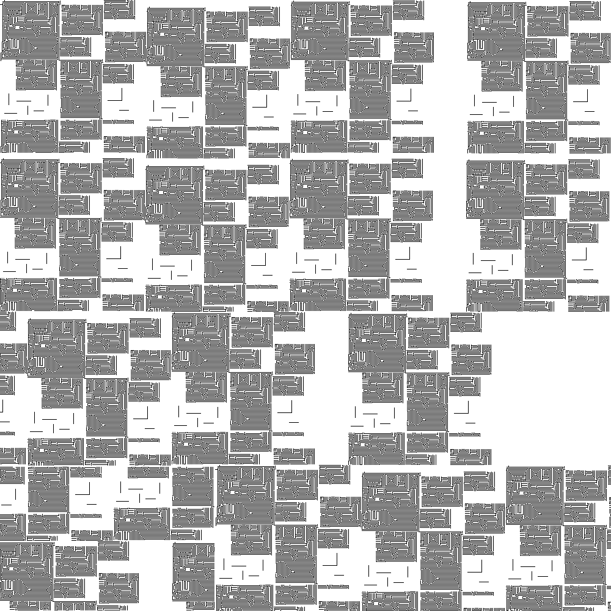

# AstarApp

AstarApp é um projeto acadêmico desenvolvido para a disciplina de Inteligência Artificial. Ele demonstra a implementação do algoritmo A* (A-Star) para encontrar o caminho mais eficiente entre dois pontos em um "mapa", representado por uma imagem.

## Sobre o Projeto

O objetivo principal é aplicar o algoritmo A* para navegação em um ambiente visual, simulando situações comuns em robótica, jogos e sistemas de navegação. A imagem é carregada e interpretada como uma grade (grid), onde cada célula pode representar um obstáculo, caminho livre ou destino.

## Funcionalidades

- Carregamento de imagem como mapa
- Interpretação de pixels como obstáculos ou caminho livre
- Definição de ponto inicial e destino
- Execução do algoritmo A* para traçar a rota ideal
- Visualização gráfica do caminho encontrado

## Exemplo

Abaixo está uma representação do mapa usado no projeto:



## Estrutura

```
AstarApp/
+-- GameLogic/
¦   +-- AStarPathFinder.cs    # Implementação do algoritmo A*
+-- Form1.cs                  # Janela principal do app
+-- GamePanel.cs              # Painel gráfico para exibir o mapa e o caminho
+-- mapa.png                  # Imagem utilizada como mapa base
+-- AstarApp.csproj
+-- AstarApp.sln
```

## Como Executar

1. Clone o repositório:
   ```bash
   git clone https://github.com/paulowrld/AstarApp.git
   cd AstarApp
   ```

2. Abra o projeto com o Visual Studio.

3. Compile e execute (`F5`).

> É necessário ter o .NET Framework ou .NET SDK compatível com Windows Forms instalado.

## Tecnologias Utilizadas

- C#
- Windows Forms (.NET)
- Algoritmo A* (A-Star)

## Referência Teórica

O algoritmo A* é uma técnica de busca heurística que combina os métodos de busca de custo uniforme e busca gulosa para encontrar o caminho de menor custo até o destino.
